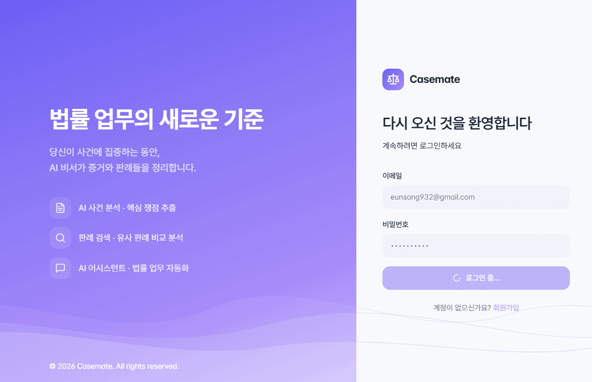
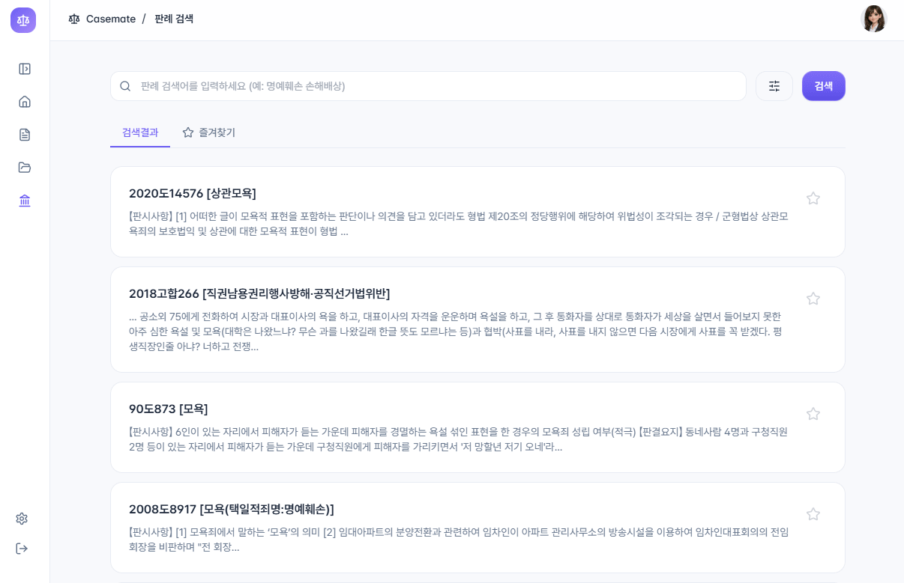
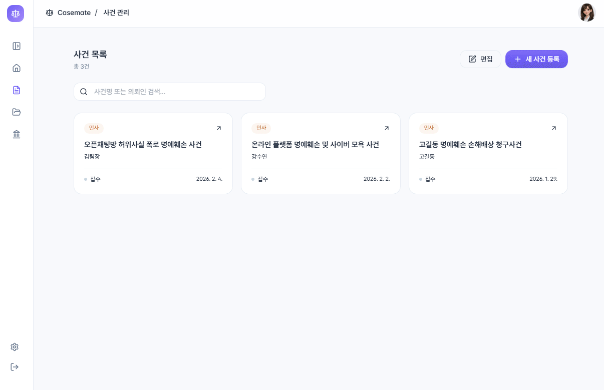
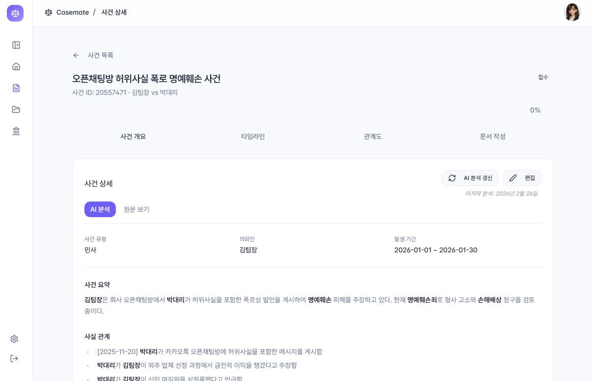
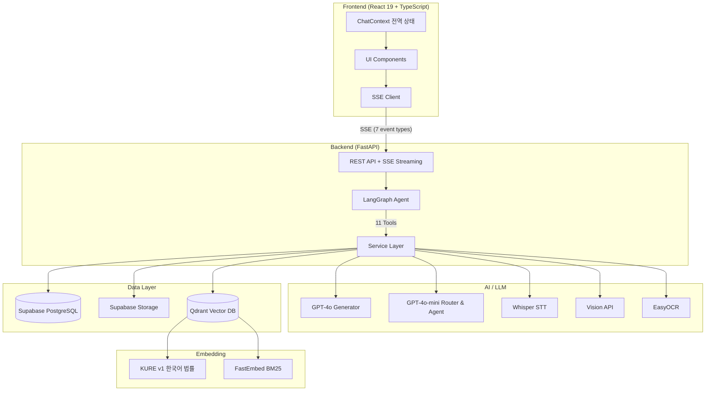
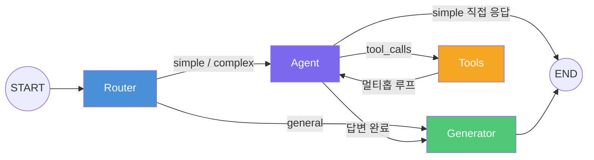

<div align="center">

# CaseMate

### AI 기반 법률 사건 관리 플랫폼

사건 분석부터 판례 검색, 증거 관리, 법률 문서 초안까지 — 하나의 AI 어시스턴트로 통합

[](https://python.org)
[](https://fastapi.tiangolo.com)
[](https://react.dev)
[](https://typescriptlang.org)
[](https://langchain-ai.github.io/langgraph/)
[](https://openai.com)
[](https://qdrant.tech)
[](LICENSE)

</div>

<br/>

<p align="center">
  
</p>

---

## 프로젝트 소개

법률 실무에서 사건 분석, 판례 조사, 증거 정리는 방대한 시간과 노력이 필요한 작업입니다.
**CaseMate**는 LangGraph 기반 AI 에이전트가 11개 도구를 자율적으로 조합하여 법률 업무를 지원하는 통합 플랫폼입니다.
하이브리드 RAG(Dense + Sparse BM25)로 30만+ 판례를 검색하고, 멀티홉 추론으로 복합 질의를 처리하며, SSE 실시간 스트리밍으로 도구 실행 과정을 투명하게 보여줍니다.

---

## 핵심 기능

### 1. AI 법률 어시스턴트

LangGraph 5-Node StateGraph 에이전트가 사용자 질문을 분석하고, 11개 도구를 자율 선택·조합하여 답변합니다.
멀티홉 추론으로 "이 사건과 유사한 판례를 찾아서 비교 분석해줘"와 같은 복합 질의를 한 번에 처리합니다.

<!-- TODO: AI 법률 어시스턴트 데모 GIF 추가 예정 -->

### 2. AI 사건 분석 & 유사 판례 비교

사건 설명서에서 배경·사실관계·쟁점을 자동 추출하고, 유사 판례를 검색하여 쟁점별 비교 분석 보고서를 생성합니다.
분석 결과는 캐싱되며, 원문 수정 시 `description_hash` 기반으로 stale 감지하여 데이터 일관성을 유지합니다.

<p align="center">
  
</p>

### 3. 판례 검색 (하이브리드 RAG)

Qdrant 하이브리드 검색(Dense + Sparse BM25)과 RRF(Reciprocal Rank Fusion) 랭킹으로 30만+ 판례를 검색합니다.
KURE 한국어 법률 특화 임베딩 + 동의어 확장 + 키워드 부스팅으로 검색 정확도를 높였습니다.

<p align="center">
  
</p>

### 4. 사건 관리

사건 등록·수정, 증거 업로드(이미지 OCR / 음성 STT / PDF 텍스트 추출), 타임라인·인물관계도 생성까지 사건의 전 과정을 관리합니다.

<p align="center">
  
</p>

### 5. AI 법률 문서 초안 작성

사건 분석 결과와 판례를 기반으로 법률 문서 초안을 자동 생성합니다.

<p align="center">
  
</p>

---

## 시스템 아키텍처



### LangGraph 에이전트 그래프



| 노드 | 모델 | 역할 |
|------|------|------|
| **Router** | GPT-4o-mini | 질문 유형 분류 (general / simple / complex) |
| **Agent** | GPT-4o-mini | 도구 선택·실행, ReAct 루프 |
| **Tools** | — | 11개 도구 실행 (LangGraph ToolNode) |
| **Generator** | GPT-4o | 최종 답변 생성, 인용 검증 (Self-RAG) |

---

## 기술 스택

| 영역 | 기술 | 선정 사유 |
|------|------|----------|
| **Backend** | FastAPI, Python 3.11+, SQLAlchemy | 비동기 SSE 스트리밍, 타입 안전성 |
| **Frontend** | React 19, TypeScript, Vite, Tailwind CSS, Radix UI | 최신 React 생태계, 접근성(a11y) |
| **AI Agent** | LangGraph, LangChain | StateGraph 기반 멀티홉 추론, 도구 오케스트레이션 |
| **LLM** | GPT-4o (Generator), GPT-4o-mini (Router/Agent) | 비용 최적화: 라우팅은 경량 모델, 생성은 고품질 모델 |
| **Vector DB** | Qdrant (하이브리드: Dense + Sparse) | RRF 랭킹, Prefetch 최적화 |
| **임베딩** | KURE v1 (한국어 법률), FastEmbed BM25 | 한국어 법률 도메인 특화 |
| **DB** | PostgreSQL (Supabase) | 관리형 DB + Row Level Security |
| **스토리지** | Supabase Storage | Signed URL 기반 증거 파일 관리 |
| **실시간** | Server-Sent Events (SSE) | 7종 이벤트로 도구 실행 과정 투명 공개 |
| **증거 처리** | EasyOCR, Whisper STT, PyMuPDF, Vision API | 이미지/음성/PDF 멀티모달 증거 분석 |

---

<details>
<summary><b>프로젝트 구조</b></summary>

```
├── backend/
│   ├── app/
│   │   ├── api/v1/           # REST API 엔드포인트
│   │   ├── home_agent/       # LangGraph 에이전트
│   │   │   ├── graph.py      #   StateGraph 정의
│   │   │   ├── nodes.py      #   Router / Agent / Generator 노드
│   │   │   ├── tools.py      #   11개 도구 정의
│   │   │   └── prompts.py    #   시스템 프롬프트
│   │   ├── models/           # SQLAlchemy ORM 모델
│   │   ├── services/         # 비즈니스 로직
│   │   │   ├── precedent_search_service.py  # 하이브리드 RAG
│   │   │   └── rag_service.py               # 통합 RAG
│   │   └── prompts/          # LLM 프롬프트 템플릿
│   ├── data/laws/            # 법령 데이터
│   └── scripts/              # 데이터 적재 스크립트
├── frontend/
│   ├── src/
│   │   ├── components/       # React 컴포넌트
│   │   ├── contexts/         # ChatContext 등 전역 상태
│   │   ├── hooks/            # useAgentSSE 등 커스텀 훅
│   │   └── lib/              # API 클라이언트, 유틸리티
│   └── public/
├── nginx/                    # Nginx 설정
└── docs/images/              # 데모 GIF
```

</details>

---

## 시작하기

### 사전 요구사항

- Python 3.11+
- Node.js 18+
- PostgreSQL (또는 [Supabase](https://supabase.com) 프로젝트)
- [Qdrant](https://qdrant.tech) 인스턴스

### Backend

```bash
cd backend
python -m venv venv && source venv/bin/activate
pip install -r requirements.txt

# .env 파일 설정
cp .env.example .env  # 아래 환경 변수 참조

uvicorn app.main:app --reload --port 8000
```

### Frontend

```bash
cd frontend
npm install
npm run dev
```

### 환경 변수

| 변수명 | 설명 |
|--------|------|
| `OPENAI_API_KEY` | OpenAI API 키 |
| `DATABASE_URL` | PostgreSQL 연결 문자열 |
| `QDRANT_URL` | Qdrant 서버 URL |
| `QDRANT_API_KEY` | Qdrant API 키 |
| `SUPABASE_URL` | Supabase 프로젝트 URL |
| `SUPABASE_ANON_KEY` | Supabase Anonymous 키 |
| `SUPABASE_SERVICE_ROLE_KEY` | Supabase Service Role 키 |
| `JWT_SECRET` | JWT 토큰 서명 키 |
| `HF_API_TOKEN` | HuggingFace API 토큰 (KURE 임베딩) |

---

## 팀

| 이름 | 역할 |
|------|------|
| **[dayforged](https://github.com/dayforged)** | AI 어시스턴트 (홈 에이전트), AI 사건 분석, AI 초안 작성, 프론트엔드 UI/UX |
| **[DaHee05](https://github.com/DaHee05)** | AI 어시스턴트 (홈 에이전트), 판례 검색/AI 비교 분석, AWS 배포, 프론트엔드 UI/UX |
| **[hdju](https://github.com/kiribati07)** | 타임라인, 인물관계도, 증거 관리/분석 (OCR · STT · VLM) |

---

## 라이선스

MIT License
